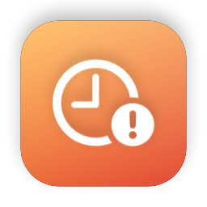

<p align="center">
  
</p>

# Stale

A tiny macOS menu bar app that shows your open GitHub pull requests sorted by how long they've
been rotting. Most PR tools show what's new; Stale shows what you've been ignoring.

| Tier   | Default | Menu bar |
|--------|---------|----------|
| Fresh  | 0–2 days  | plain clock |
| Aging  | 3–6 days  | plain clock |
| Stale  | 7–13 days | orange clock + count |
| Rotten | 14+ days  | red clock + count |

## Install

Requires **macOS 14 (Sonoma) or later**. Universal binary, Apple Silicon and Intel. The app is
signed with a Developer ID and notarized by Apple, so it opens with a normal double-click.

1. Download the latest `Stale-x.y.z.dmg` from [Releases](../../releases/latest) and drag Stale to Applications.
2. Make sure the [GitHub CLI](https://cli.github.com) is signed in: `brew install gh && gh auth login`.
3. Open Stale, click the clock in the menu bar → **Settings** → **Sign in with GitHub CLI**.

That's it. Stale stores nothing: on each refresh it asks `gh auth token` for credentials, so
there are no tokens to create and no Keychain prompts. `gh auth logout` signs Stale out too.

Don't use the GitHub CLI? Paste a classic personal access token with the `repo` scope
(plus `read:org` for organization repos) instead. Pasted tokens are kept in the macOS Keychain.

## What it accesses

Stale talks to exactly one host: the GitHub API — `api.github.com`, or your Enterprise Server
if you change the API base. No telemetry, no analytics, no other network calls.

- **GitHub CLI sign-in** reuses the token `gh` already holds. Stale runs `gh auth token` on each
  refresh and never writes it to disk, so whatever scopes your `gh` login has are the scopes
  Stale can use. `gh auth logout` signs Stale out too.
- **Pasted tokens** are stored in your login Keychain as *Stale – GitHub token*, and nowhere else.
- **Cached PR data** — titles, repo names, numbers, timestamps — is written unencrypted to
  `~/Library/Application Support/Stale/pull-requests.json` so the dropdown is populated instantly
  on launch and stays useful while offline. No token is ever written to it; delete the file to
  clear it.
- If your organization enforces **SAML SSO**, a classic PAT has to be SSO-authorized for that org
  or its pull requests come back empty with no visible error. The GitHub CLI path avoids this.

## Settings

- **Staleness**: measure by days open or days since last activity; adjust the tier thresholds.
- **Organizations**: untick any org (or your personal account) to hide its PRs.
- **Refresh**: poll interval (5 minutes to 1 hour) and whether to hide drafts.

Clicking a PR opens it in your browser. If GitHub rate-limits you or you're offline, the last
result stays visible with a small warning.

## Build from source

Requires macOS 14+ and Xcode 16+. Open `Stale.xcodeproj` and press ⌘R. No dependencies.

```sh
xcodebuild -project Stale.xcodeproj -scheme Stale build
```

## How it works

One GraphQL request per poll (`is:pr is:open author:@me`, up to 100 PRs) returns each PR's
review decision and CI status plus the organizations you belong to. Age is computed locally
and re-evaluated every minute, so tiers roll over between polls.

```
Stale/
├── StaleApp.swift        MenuBarExtra + Settings scene
├── Models/               PullRequest, RepoOwner, AppSettings
├── GitHub/               GraphQL client, GitHub CLI token import
├── Keychain/             Keychain wrapper (pasted tokens only)
├── Staleness/            Tiers, thresholds, sorting — pure functions
├── Store/                PRStore (polling, cache), SettingsStore
└── Views/                Menu bar label, dropdown, PR row, settings
```

## Releasing

Bump `MARKETING_VERSION` in `Version.xcconfig` and push to `main`. GitHub Actions builds,
signs, notarizes, and publishes a DMG release. See [docs/RELEASING.md](docs/RELEASING.md)
for the one-time secret setup.

## License

[MIT](LICENSE)
