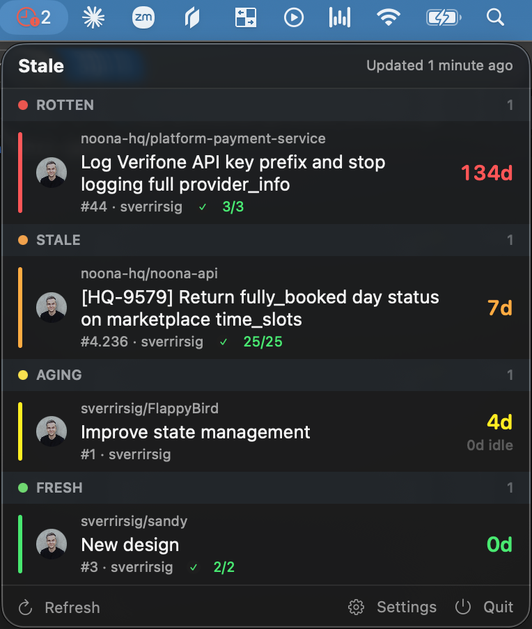
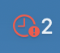

<p align="center">
  
</p>

<h1 align="center">Stale</h1>

<p align="center">
  A macOS menu bar app that shows your open GitHub pull requests, sorted by how long they've been rotting.<br>
  Most PR tools show you what's new. Stale shows you what you've been ignoring.
</p>

<p align="center">
  
</p>

## Quiet until it isn't

Stale works like any good monitoring system: silent when everything is fine, impossible to
miss when it isn't.

<table align="center">
  <tr>
    <td align="center"></td>
    <td>Everything is fresh or merely aging. A plain clock sits in the menu bar and keeps to itself. No badge, no count, nothing to look at.</td>
  </tr>
  <tr>
    <td align="center"></td>
    <td>Something has crossed into stale territory. The clock takes on the colour of your worst PR, orange for stale and red for rotten, and picks up a count of how many need you.</td>
  </tr>
</table>

No news is good news. When the clock is plain, you have nothing to do here.

### Tiers

Every open PR you've authored lands in one of four tiers based on its age. The thresholds are
yours to change.

| Tier   | Default   | Menu bar                 |
|--------|-----------|--------------------------|
| Fresh  | 0–2 days  | plain clock              |
| Aging  | 3–6 days  | plain clock              |
| Stale  | 7–13 days | orange clock with count  |
| Rotten | 14+ days  | red clock with count     |

Age is measured in days open by default. Switch it to days since last activity if you'd rather
be nagged about PRs nobody has touched than PRs that are simply old.

### What each PR shows

- Repository and title, with a **Draft** tag where relevant.
- PR number and author.
- Review state: approved, changes requested, or review pending.
- Checks on the head commit as a passed-of-total count, green when they've all passed, red when
  one has failed.
- Age in days, coloured by tier, with the other clock (idle or open) alongside when it differs.

Clicking a PR opens it in your browser.

## Install

Requires **macOS 14 (Sonoma) or later**. Universal binary for Apple Silicon and Intel. Releases
are signed with a Developer ID and notarized by Apple, so the app opens with a normal double-click.

1. Download the latest `Stale-x.y.z.dmg` from [Releases](../../releases/latest) and drag Stale to Applications.
2. Make sure the [GitHub CLI](https://cli.github.com) is signed in: `brew install gh && gh auth login`.
3. Open Stale, click the clock in the menu bar, then **Settings**, then **Sign in with GitHub CLI**.

That's it. Stale stores no credentials of its own: on each refresh it asks `gh auth token`, so
there are no tokens to create and no Keychain prompts. `gh auth logout` signs Stale out too.

Don't use the GitHub CLI? Paste a classic personal access token with the `repo` scope, plus
`read:org` for organization repositories. Pasted tokens are kept in the macOS Keychain.

## Settings

- **Staleness**: measure by days open or days since last activity, and adjust the tier thresholds.
- **Organizations**: untick any organization, or your personal account, to hide its PRs.
- **Refresh**: poll interval from 5 minutes to 1 hour, and whether to hide drafts.

If GitHub rate-limits you or you're offline, the last result stays visible with a small warning.

## What it accesses

Stale talks to exactly one host: the GitHub API at `api.github.com`, or your Enterprise Server
if you change the API base. No telemetry, no analytics, no other network calls.

- **GitHub CLI sign-in** reuses the token `gh` already holds. Stale runs `gh auth token` on each
  refresh and never writes the token to disk, so whatever scopes your `gh` login has are the
  scopes Stale can use.
- **Pasted tokens** are stored in your login Keychain as *Stale – GitHub token*, and nowhere else.
- **Cached PR data** (titles, repository names, numbers, timestamps, check counts) is written
  unencrypted to `~/Library/Application Support/Stale/pull-requests.json` so the dropdown is
  populated instantly on launch and stays useful offline. No token is ever written to it. Delete
  the file to clear it.
- If your organization enforces **SAML SSO**, a classic personal access token has to be
  SSO-authorized for that organization or its pull requests come back empty with no visible
  error. The GitHub CLI path avoids this.

## How it works

One GraphQL request per poll (`is:pr is:open author:@me`, up to 100 PRs) returns each PR's
review decision, the check runs and statuses on its head commit, and the organizations you
belong to. Age is computed locally and re-evaluated every minute, so tiers roll over between polls.

```
Stale/
├── StaleApp.swift        MenuBarExtra + Settings scene
├── Models/               PullRequest, RepoOwner, AppSettings
├── GitHub/               GraphQL client, GitHub CLI token import
├── Keychain/             Keychain wrapper (pasted tokens only)
├── Staleness/            Tiers, thresholds, sorting — pure functions
├── Store/                PRStore (polling, cache), SettingsStore
└── Views/                Menu bar label, dropdown, PR row, settings
```

## Build from source

Requires macOS 14+ and Xcode 16+. Open `Stale.xcodeproj` and press ⌘R. No dependencies.

```sh
xcodebuild -project Stale.xcodeproj -scheme Stale build
```

## Releasing

Bump `MARKETING_VERSION` in `Version.xcconfig` and push to `main`. GitHub Actions builds,
signs, notarizes, and publishes a DMG release. See [docs/RELEASING.md](docs/RELEASING.md)
for the one-time secret setup.

## License

[MIT](LICENSE)
